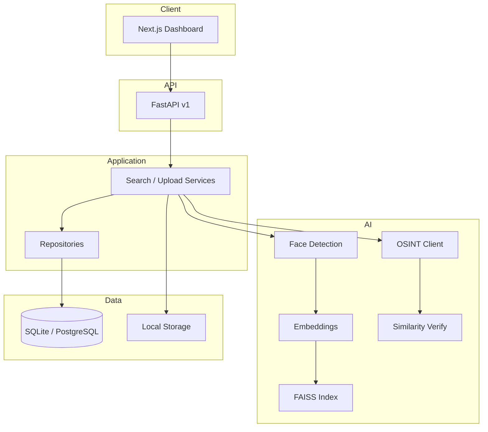
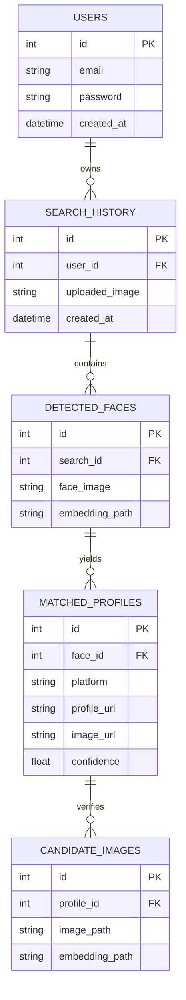

# Face Search & OSINT Platform

Production-oriented scaffold for **local AI face recognition** (InsightFace / ArcFace / ONNX Runtime / FAISS) with **optional public OSINT** profile discovery. Application pipeline logic is intentionally **not implemented** in this phase—only structure, configuration, API contracts, and documentation.

## 1. Folder structure

```
face-search-platform/          # (repository root: Sherlock/)
├── README.md
├── LICENSE
├── .env.example
├── .gitignore
├── docker-compose.yml
├── Dockerfile
├── requirements.txt
├── pyproject.toml
├── .pre-commit-config.yaml
├── alembic.ini
├── alembic/
├── configs/
├── docs/
├── scripts/
├── tests/
├── uploads/ cache/ embeddings/ results/ logs/ models/ data/
├── ai/                         # Shared model asset layout (docs only)
├── backend/
│   └── app/
│       ├── main.py
│       ├── api/v1/
│       ├── search/             # Search orchestration (LOCAL / INTERNET / HYBRID)
│       ├── ai/                 # Face AI backbone (detection, embedding, matching, FAISS)
│       ├── osint/              # Agent Reach discovery layer (isolated adapter)
│       ├── llm/                # Optional Ollama (summarization only)
│       ├── services/
│       ├── repositories/
│       ├── models/
│       ├── schemas/
│       ├── database/
│       ├── middleware/
│       ├── core/
│       ├── config/
│       ├── dependencies/
│       ├── workers/
│       └── utils/
└── frontend/
    └── src/
        ├── app/
        ├── components/
        ├── hooks/
        ├── services/
        ├── types/
        └── utils/
```

See [docs/folder-structure.md](docs/folder-structure.md) for module-level detail.

## 2. Technology stack

| Layer | Choices |
|--------|---------|
| **Frontend** | Next.js, React, TypeScript, TailwindCSS, shadcn/ui (configured), TanStack Query, Axios, React Hook Form, Zod, Framer Motion |
| **Backend** | Python 3.12+, FastAPI, Uvicorn, Pydantic, SQLAlchemy 2 async, Alembic, DI via FastAPI `Depends` |
| **AI** | InsightFace, RetinaFace, ArcFace, ONNX Runtime, OpenCV, Pillow, NumPy, FAISS |
| **DB (dev)** | SQLite via `aiosqlite` |
| **DB (prod)** | PostgreSQL via `asyncpg` |
| **Vector DB** | FAISS (local index files) |
| **Optional** | Redis, Celery, Docker, Nginx |

## 3. Architecture overview

Clean Architecture with **inward dependencies**: API → Services → SearchOrchestrator → strategies. Face AI lives in `backend/app/ai/` with lazy-loaded models; the **SearchOrchestrator** (`backend/app/search/`) routes LOCAL/INTERNET/HYBRID modes and Agent Reach is isolated behind an adapter in `backend/app/osint/`.



Full diagrams: [docs/architecture.md](docs/architecture.md).

## 4. Database schema

ORM entities are defined in `backend/app/models/entities.py` (migrations pending).



## 5. API design

Base prefix: **`/api/v1`** (see [docs/api.md](docs/api.md)).

| Method | Path | Description |
|--------|------|-------------|
| `POST` | `/api/v1/upload` | Upload image (validated) |
| `POST` | `/api/v1/search` | Start search job |
| `GET` | `/api/v1/search/{id}` | Search status & results |
| `GET` | `/api/v1/history` | User search history |
| `DELETE` | `/api/v1/history/{id}` | Delete history entry |
| `GET` | `/api/v1/profile/{id}` | Matched profile detail |
| `POST` | `/api/v1/auth/register` | Register |
| `POST` | `/api/v1/auth/login` | JWT login |
| `GET` | `/health` | Health check |

Interactive docs: `http://localhost:8000/docs` after starting the API.

## 6. Configuration files

| File | Purpose |
|------|---------|
| `.env.example` | Environment template |
| `requirements.txt` | Python dependencies |
| `pyproject.toml` | Tooling (black, isort, mypy, pytest) |
| `.pre-commit-config.yaml` | Git hooks |
| `alembic.ini` + `alembic/` | DB migrations |
| `configs/logging.yaml` | Standard logging schema |
| `configs/nginx/nginx.conf` | Reverse proxy (Docker profile) |
| `frontend/components.json` | shadcn/ui |

## 7. Requirements

All stable pins are in [`requirements.txt`](requirements.txt). Install InsightFace separately when implementing AI (platform-specific wheels).

## 8. Docker setup

```bash
cp .env.example .env
docker compose up --build
```

Services: `backend`, `frontend`, `postgres`, `redis`; optional `nginx` and `worker` via Compose profiles.

## 9. Development workflow

```bash
python -m venv .venv
.venv\Scripts\activate          # Windows
pip install -r requirements.txt
pip install -r requirements-ai.txt   # InsightFace (SCRFD/RetinaFace/ArcFace)
cp .env.example .env
python scripts/init_storage.py
python scripts/download_models.py    # downloads buffalo_l pack to models/
python scripts/run_api.py            # dev server (Windows Selector loop for async psycopg)
```

Face detection (Phase 3) can be exercised directly:

```bash
python scripts/detect_faces.py path/to/photo.jpg
```

Phase 4/5 — landmark-based alignment + ArcFace embedding (512-d, in-memory):

```bash
python scripts/detect_faces.py --embed path/to/photo.jpg
```

Phase 8/9 — grow the local face database and search it (FAISS ids = DetectedFace ids):

```bash
python scripts/ingest_gallery.py --gallery path/to/known_faces/
python scripts/run_api.py          # then POST /api/v1/search {"image_id": "...", "mode": "local"}
```

Frontend:

```bash
cd frontend
npm install
npm run dev
```

Pre-commit:

```bash
pre-commit install
pre-commit run --all-files
```

Tests:

```bash
pip install -r requirements.txt
pytest backend/tests tests
```

Details: [docs/installation.md](docs/installation.md).

## 10. Deployment workflow

1. Set `APP_ENV=production`, strong `SECRET_KEY`, PostgreSQL `DATABASE_URL`.
2. Run Alembic migrations against PostgreSQL.
3. Mount persistent volumes for `uploads/`, `embeddings/`, `models/`.
4. Enable `docker compose --profile production` for Nginx.
5. Optionally scale Celery workers for long OSINT / batch inference jobs.

See [docs/deployment.md](docs/deployment.md).

## 11. Testing strategy

| Scope | Location | Focus |
|-------|----------|--------|
| API integration | `backend/tests/integration/` | Routes, auth, upload validation |
| Unit | `backend/tests/unit/` | Services, ranking, similarity |
| Frontend | `frontend/tests/` | Vitest component/API hooks |
| E2E (future) | `tests/e2e/` | Upload → search → results |

## 12. Future scalability

- Horizontal API replicas behind Nginx; sticky sessions not required (stateless JWT).
- Celery queue for search jobs; Redis for rate limits and response cache.
- Sharded FAISS or migrate to dedicated vector DB for billion-scale indexes.
- GPU nodes optional via `AI_DEVICE=cuda` and ONNX CUDA provider.
- Separate object storage (S3-compatible) for uploads and embeddings.

See [docs/scalability.md](docs/scalability.md).

---

## AI workflow (target)

```
Upload → Detect → Align → Embed → FAISS → OSINT → Download candidates
→ Embed candidates → Similarity → Aggregate profiles → Rank → Dashboard
```

## Security (planned)

JWT auth, bcrypt passwords, rate limiting, MIME/size validation, CORS, secure upload paths.

## License

MIT — see [LICENSE](LICENSE).
