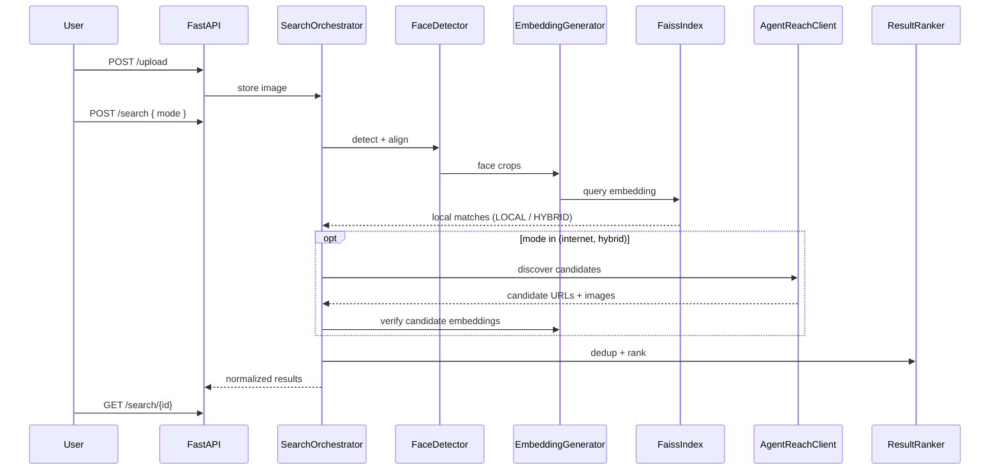

# Architecture

## Layers

1. **Presentation** — `frontend/` (Next.js App Router, TanStack Query).
2. **API** — `backend/app/api/v1/controllers/` (thin HTTP adapters).
3. **Application** — `backend/app/services/` (use cases, orchestration).
4. **Domain / persistence** — `backend/app/models/`, `repositories/`.
5. **Infrastructure** — `database/`, `ai/` (face AI), `osint/` (Agent Reach), `llm/` (optional Ollama), `workers/`, local filesystem storage.

Dependencies point inward: controllers depend on services; services depend on the `SearchOrchestrator`, which selects a search strategy; strategies depend on Repository and AI ports; AI/OSINT/LLM modules do not depend on FastAPI.

## Responsibility boundaries

| Boundary | Location | Responsibility |
|----------|----------|----------------|
| Face AI | `ai/` | Detection, alignment, embedding, similarity (visual) |
| Local search | `search/local_search.py` + `ai/vector_db/` | FAISS-indexed data via `VectorStore` port |
| Internet OSINT | `osint/` | Agent Reach discovery (adapter-isolated) |
| Optional LLM | `llm/` | Ollama summarization/extraction only |
| Orchestration | `search/orchestrator.py` | Routes LOCAL / INTERNET / HYBRID, merges, dedups, ranks |

## AI pipeline (sequence)

## Search context & discovery (Phases 11–17)

`discovery/` turns an uploaded image into non-sensitive search signals and
feeds them to replaceable providers:

| Module | Phase | Responsibility |
|--------|-------|----------------|
| `context/exif.py` | 11 | Local EXIF: timestamp, camera, software, orientation; GPS kept approximate (`public_location()` rounds to ~1 km) |
| `context/ocr.py` | 12 | OCR via pluggable `OCREngine` (Tesseract backend lazy-imported) + engine-agnostic URL/username/hashtag extraction |
| `fingerprinting.py` | 13 | SHA256 / aHash / dHash / pHash (pure NumPy DCT-II), exact + near-duplicate helpers |
| `context/visual.py` | 14 | Offline hints only: brightness, saturation, dominant colors. Landmark/object lists stay empty unless a model fills them |
| `context/builder.py` | 15 | `SearchContextBuilder` merges all signals (plus optional user filters) into `SearchContext` |
| `engine.py` | 16 | `DiscoveryEngine` generates tasks, runs only `available` providers, normalizes + deduplicates candidates |
| `providers/base.py` | 17 | `ImageSearchProvider` / `WebSearchProvider` ABCs — replaceable, public interfaces only; each exposes `status()` |
| `osint/agent_reach/` | 18 | CLI wrapper (`doctor --json` probe + `get <channel> --json` reads), tolerant parser, normalizer, `AgentReachWebProvider` (web-only) |

Internet and hybrid modes are now **wired**: `InternetSearchService` runs the
Discovery Engine and returns a degraded-but-usable response (HTTP 202,
`status: "degraded"`, explicit `providers.agent_reach.available: false`) when
Agent Reach is not installed, instead of 501. Hybrid merges local + internet
and keeps local results when the internet source is down.

## Web research agent (Phases 19–22)

`agents/web_research/` runs a bounded investigation over candidate pages with
explicit, traceable tools:

| Module | Phase | Responsibility |
|--------|-------|----------------|
| `schemas.py` | 19 | `Evidence` + `ResearchOutput` result types (URL-scoped, non-sensitive) |
| `state.py` | 21 | `ResearchState`: dedupe of visited / discovered / evidence, page + tool counters |
| `tools.py` | 20 | 8 controlled tools via a small `ToolRegistry` (LLM dispatch reserved for later) |
| `planner.py` | 19 | Deterministic heuristic `ToolPlanner` (fetch → extract → find links) |
| `agent.py` | 19 | `ResearchAgent` loop records `Evidence` into `ResearchState` |
| `prompts.py` | 26 (reserved) | Optional LLM planner prompts — never carry faces or identity claims |
| `policies.py` | 22 | `CrawlPolicies` (page/runtime/image budgets), per-domain `RateLimiter`, `RobotsTxt`, SSRF `UrlGuard` becoming live in Phase 22 |

The research agent is gated by `AGENT_MAX_*` settings in `.env.example` and
wired in the DI container (`get_research_agent`). It is scheduled after
discovery in a later phase and is intentionally conservative (stdlib-only so
far — httpx usage is gated behind a feature check).

Notes:
- All predictions are search hints, never assertions about identity or location.
- OCR is optional; a missing engine degrades to `ocr=None` instead of failing.
- Agent Reach is a **web** provider only; it is never claimed as an image-search provider.

## Performance tactics

- **Lazy model loading** — `AI_LAZY_LOAD=true`; load InsightFace/ONNX on first request or worker startup.
- **Model caching** — singleton providers in DI container.
- **Async I/O** — httpx/aiofiles for OSINT downloads; thread pool for CPU-bound ONNX when needed.
- **Batch inference** — batch candidate embeddings in workers.
- **FAISS** — memory-mapped index; periodic rebuild jobs.
- **Background tasks** — Celery for end-to-end search when OSINT is enabled.

## SOLID mapping

| Principle | Application |
|-----------|-------------|
| **S** | Separate `UploadService`, `SearchService`, AI detectors |
| **O** | Platform/Agent Reach adapters in `osint/` |
| **L** | Repository base + concrete SQLAlchemy repos |
| **I** | Narrow ports for `VectorStore`, `AgentReachClient`, `EmbeddingGenerator` |
| **D** | FastAPI `Depends` wires concrete implementations |
