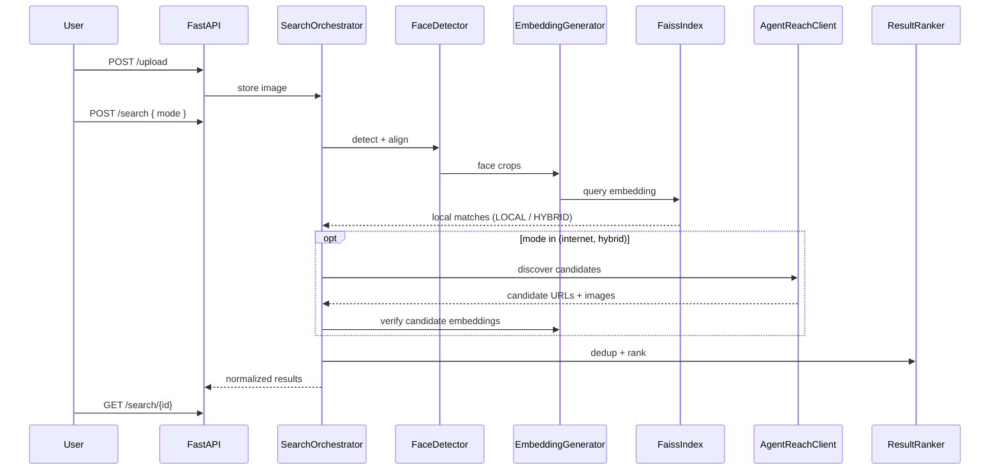

# Architecture

## Layers

1. **Presentation** — `frontend/` (Next.js App Router, TanStack Query).
2. **API** — `backend/app/api/v1/controllers/` (thin HTTP adapters).
3. **Application** — `backend/app/services/` (use cases, orchestration).
4. **Domain / persistence** — `backend/app/models/`, `repositories/`.
5. **Infrastructure** — `database/`, `ai/` (face AI), `osint/` (Agent Reach), `llm/` (optional Ollama), `workers/`, local filesystem storage.

Dependencies point inward: controllers depend on services; services depend on the `SearchOrchestrator`, which selects a search strategy; strategies depend on Repository and AI ports; AI/OSINT/LLM modules do not depend on FastAPI.

## Responsibility boundaries

| Boundary | Location | Responsibility |
|----------|----------|----------------|
| Face AI | `ai/` | Detection, alignment, embedding, similarity (visual) |
| Local search | `search/local_search.py` + `ai/vector_db/` | FAISS-indexed data via `VectorStore` port |
| Internet OSINT | `osint/` | Agent Reach discovery (adapter-isolated) |
| Optional LLM | `llm/` | Ollama summarization/extraction only |
| Orchestration | `search/orchestrator.py` | Routes LOCAL / INTERNET / HYBRID, merges, dedups, ranks |

## AI pipeline (sequence)

## Performance tactics

- **Lazy model loading** — `AI_LAZY_LOAD=true`; load InsightFace/ONNX on first request or worker startup.
- **Model caching** — singleton providers in DI container.
- **Async I/O** — httpx/aiofiles for OSINT downloads; thread pool for CPU-bound ONNX when needed.
- **Batch inference** — batch candidate embeddings in workers.
- **FAISS** — memory-mapped index; periodic rebuild jobs.
- **Background tasks** — Celery for end-to-end search when OSINT is enabled.

## SOLID mapping

| Principle | Application |
|-----------|-------------|
| **S** | Separate `UploadService`, `SearchService`, AI detectors |
| **O** | Platform/Agent Reach adapters in `osint/` |
| **L** | Repository base + concrete SQLAlchemy repos |
| **I** | Narrow ports for `VectorStore`, `AgentReachClient`, `EmbeddingGenerator` |
| **D** | FastAPI `Depends` wires concrete implementations |
